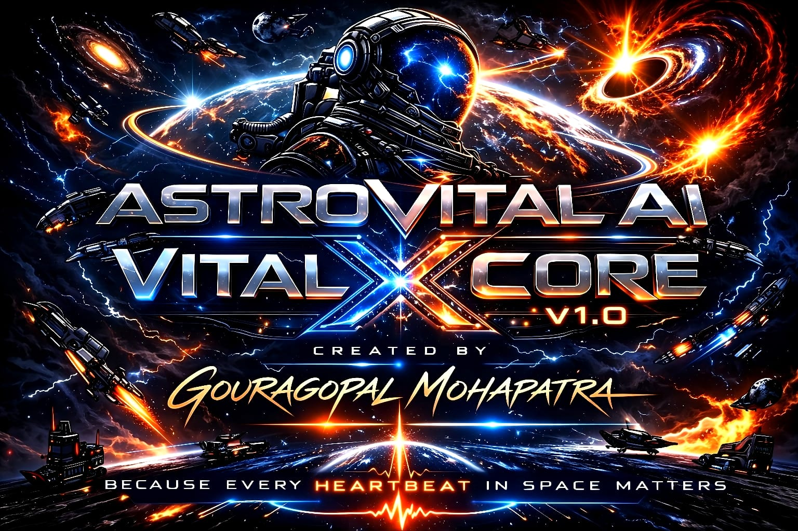

<p align="center">
  
</p>
# ASTROVITAL AI — VITALX CORE V1
> *"Because Every Heartbeat in Space Matters."*


---

## Developer
| Field | Details |
|---|---|
| **Name** | Gouragopal Mohapatra |
| **Identity** | Independent Researcher |
| **GitHub** | GOURGOPAL618 |
| **Date** | March 2026 |
| **Location** | India |

---

## What is AstroVital AI?
AstroVital AI is an edge-deployed Clinical Decision 
Support System (CDSS) for astronaut health monitoring 
in deep space missions — no Earth connection needed.

---

## The Problem
- 🫀 Cardiovascular deconditioning in microgravity
- 🦴 1-2% bone density loss per month
- 💪 Muscle atrophy — up to 16% in short missions
- 😴 Average 5.4 hours sleep in-flight
- ☢️ 50-100 mSv radiation per 6 months
- 🛡️ Immune dysregulation & viral reactivation

> Current medical support is REACTIVE.
> AstroVital AI makes it PREDICTIVE.

---

## VitalX Core V1 — 3 Innovations

| Innovation | Algorithm | Purpose |
|---|---|---|
| **Innovation 3** | RF + Regression | Noisy sensor correction |
| **Innovation 6** | RF Feature Importance | Biomarker discovery |
| **Innovation 1** | Decision Tree | Edge CDSS decision |

---

## Pipeline
```
Noisy Data → Innovation 3 → Innovation 6 → Innovation 1 → Clinical Decision
```

---

## Project Structure
```
ASTROVITAL_AI_VITALX_CORE_V1/
├── AI_CORE/
├── ASTRO_DOCS/
├── DATA_VAULT/
│   ├── MISSION_READY_DATA/
│   └── SENSOR_INTAKE/
├── MISSION_REPORTS/
├── MODEL_HANGAR/
├── VITALX_LAB/
│   ├── 01_data_exploration.ipynb
│   ├── 02_data_preprocessing.ipynb
│   └── 03_feature_engineering.ipynb
└── README.md
```

---

## Technology Stack
| Tool | Purpose |
|---|---|
| Python 3.x | Core language |
| scikit-learn | ML algorithms |
| Pandas + NumPy | Data processing |
| Matplotlib + Seaborn | Visualization |
| Jupyter Notebook | Development |
| Streamlit | Web app (post V1) |

---

## Research Foundation
- 12 peer-reviewed spaceflight papers reviewed
- 6 innovations identified
- 3 implemented in V1
- Paper targeting: Acta Astronautica / npj Microgravity

---

## Week 1 — Complete ✅
- ✅ Notebook 01 — Data Exploration & Design
- ✅ Notebook 02 — Dataset Generation & Preprocessing
- ✅ Notebook 03 — Feature Engineering
- ✅ Dataset: 1000 records · 18 features · GREEN/YELLOW/RED

---

## Multi-Version Roadmap
| Version | Focus | Status |
|---|---|---|
| **v1.0 VitalX Core** | CDSS — Innovation 1,3,6 | 🟢 ACTIVE |
| **v2.0 NeuralBeat** | Deep Learning + Digital Twins | ⏳ Planned |
| **v3.0 OmniSense** | Multi-Modal Sensor Fusion | ⏳ Planned |
| **v4.0 MissionMind** | Real-Time Edge Deployment | ⏳ Planned |

---

## Copyright
© 2026 Gouragopal Mohapatra — All Rights Reserved
This project is independently developed with no 
institutional affiliation.
Unauthorized use, reproduction or distribution is 
strictly prohibited under Indian Copyright Act, 1957.
