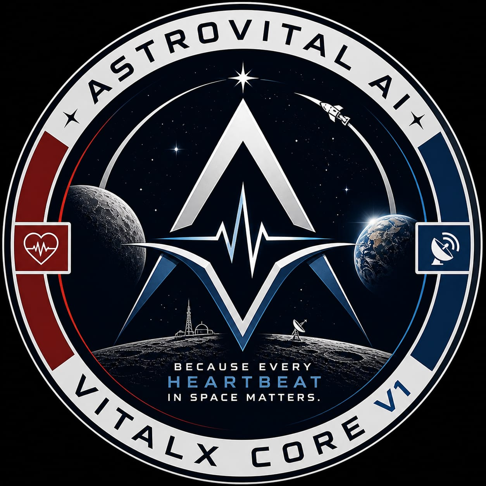

<div align="center">



<br/>

# ASTROVITAL AI — VITALX CORE V1

### *"Because Every Heartbeat in Space Matters."*

<br/>

[](https://github.com/GOURGOPAL618/ASTROVITAL_AI_VITALX_CORE_V1)
[](https://github.com/GOURGOPAL618/ASTROVITAL_AI_VITALX_CORE_V1)
[](https://python.org)
[](LICENSE)
[](VITALX_LAB/)
[](ASTRO_DOCS/)
[](MODEL_HANGAR/)
[](VITALX_LAB/)

<br/>

**Developer & Principal Investigator**  
**Gouragopal Mohapatra**  
Independent Researcher · AI & Space Technology · India  
[@GOURGOPAL618](https://github.com/GOURGOPAL618)

**Program Identity**  
ASTROVITAL AI · Jagannath Command Centre (JCC)

**Development Period**  
March 16, 2026 — May 12, 2026 · 57 Days · 100% Solo

<br/>

---

*The first working edge-deployed Clinical Decision Support System*  
*for astronaut health monitoring in deep space missions.*  
*Built independently. Verified publicly. Aimed at the stars.*

---

</div>

<br/>

## Table of Contents

- [Mission Brief](#mission-brief)
- [The Problem No One Solved](#the-problem-no-one-solved)
- [The 12-Year Gap](#the-12-year-gap)
- [System Architecture](#system-architecture)
- [Three Core Innovations](#three-core-innovations)
- [Performance Results](#performance-results)
- [Research Foundation](#research-foundation)
- [Artemis II Simulation](#artemis-ii-simulation)
- [Project Structure](#project-structure)
- [Technology Stack](#technology-stack)
- [Multi-Version Roadmap](#multi-version-roadmap)
- [Honest Limitations](#honest-limitations)
- [Publication Targets](#publication-targets)
- [Governance & Security](#governance--security)
- [Citation](#citation)
- [Dedication](#dedication)
- [Copyright](#copyright)

---

<br/>

## Mission Brief

> **Classification:** Research Prototype — V1 Complete  
> **Domain:** Space Medicine · Aerospace AI · Edge Machine Learning  
> **Operational Target:** Deep Space Crewed Missions — Mars Transit & Beyond  
> **Core Capability:** Autonomous, real-time, explainable crew health classification with zero Earth dependency  
> **Development Model:** Independent Research — No institutional assignment — 100% solo

ASTROVITAL AI — VITALX CORE V1 is an autonomous Clinical Decision Support System (CDSS) engineered for the monitoring and triage of astronaut physiological health in deep space mission environments. The system fuses three independently developed machine learning innovations into a single end-to-end pipeline — receiving raw, radiation-corrupted sensor data as input and delivering a classified, explainable health status decision as output — with no cloud connection, no communication latency dependency, and no requirement for Earth-based medical oversight at any stage of operation.

This is not a simulation of a concept. This is a working system, trained on validated synthetic data, evaluated against reproducible benchmarks, and demonstrated on the actual crew of NASA's Artemis II mission. Every notebook, every model, and every result is publicly committed and independently verifiable.

<br/>

---

## The Problem No One Solved

<div align="center">

```
┌─────────────────────────────────────────────────────────────────┐
│                    DEEP SPACE MEDICAL REALITY                   │
├─────────────────────────────────────────────────────────────────┤
│  Mars Communication Delay     →    24 minutes one-way           │
│  Earth Medical Response Time  →    48+ minutes minimum          │
│  Acute cardiac event window   →    4–6 minutes                  │
│  Gap between need and help    →    ABSOLUTE                     │
├─────────────────────────────────────────────────────────────────┤
│  No hospital exists in deep space.                              │
│  No physician can intervene across a 24-minute signal gap.      │
│  The crew is alone. The system must not be.                     │
└─────────────────────────────────────────────────────────────────┘
```

</div>

Astronauts on deep space missions face six simultaneous, compounding physiological threats — each capable of incapacitating a crew member, each capable of becoming mission-critical within hours:

| Threat | Mechanism | Consequence |
|---|---|---|
| 🫀 **Cardiovascular Deconditioning** | Microgravity fluid redistribution, cardiac atrophy | Reduced emergency response capacity |
| 🦴 **Bone Density Loss** | 1–2% per month in microgravity | Structural fracture risk during EVA and reentry |
| 💪 **Muscle Atrophy** | Up to 16% in short missions without countermeasures | Impaired physical mission execution |
| 😴 **Circadian Disruption** | 16 sunrises per day on ISS — complete rhythm destruction | Cognitive degradation, immune suppression |
| ☢️ **Radiation Exposure** | 50–100 mSv per 6-month mission — 10–20× Earth occupational limit | CNS effects, immune compromise, carcinogenic risk |
| 🛡️ **Immune Dysregulation** | Latent viral reactivation, reduced T-cell response in orbit | Active infection risk with no medical facility |

Current onboard health monitoring systems are **reactive**. They record. They alert after thresholds are breached. They do not predict. They do not decide. They do not act.

**VITALX CORE V1 changes this.**

<br/>

---

## The 12-Year Gap

<div align="center">

```
  2010          2014          2018          2022          2026
   │             │             │             │             │
   ▼             ▼             │             │             ▼
Digital       CDSS for         │             │          VITALX
Twin          Space            │             │          CORE V1
Proposed      Proposed         │             │          BUILT
(Literature)  (Literature)     │             │          ✅
              │                │             │            |
              └─────────────── ┴──────────────────────────┘
                    12 YEARS — PAPERS ONLY
                    NO WORKING SYSTEM ANYWHERE
```

</div>

The concept of an autonomous Clinical Decision Support System for human spaceflight was formally proposed in the peer-reviewed literature in **2014**. The concept of a physiological Digital Twin for astronaut health was proposed as early as **2010**.

Between those proposals and May 2026 — **twelve to sixteen years** — the research community produced reviews, critiques, theoretical frameworks, and follow-on proposals. What it did not produce was a working system.

**VITALX CORE V1 is the first.**

Not the first proposed. Not the first theorized. The first **built**, **trained**, **evaluated**, and **demonstrated** on a real mission crew. Built independently, in India, by a second-year undergraduate student — because the gap was real, the need was documented, and no one else had closed it.

<br/>

---

## System Architecture

<div align="center">

```
╔════════════════════════════════════════════════════════════════════╗
║              VITALX CORE V1 — PIPELINE ARCHITECTURE                ║
╠════════════════════════════════════════════════════════════════════╣
║                                                                    ║
║   [ RAW SENSOR INPUT ]                                             ║
║   9 physiological parameters · radiation-corrupted · noisy         ║
║          │                                                         ║
║          ▼                                                         ║
║   ┌─────────────────────────────────────────────┐                  ║
║   │  INNOVATION 3 — SENSOR DRIFT CORRECTION     │                  ║
║   │  Multivariate Regression + Random Forest    │                  ║
║   │  R² = 0.823 · MAE improvement = 9.23%       │                  ║
║   └─────────────────────────────────────────────┘                  ║
║          │                                                         ║
║          ▼  [ CLEAN SIGNAL ]                                       ║
║   ┌─────────────────────────────────────────────┐                  ║
║   │  INNOVATION 6 — BIOMARKER DISCOVERY         │                  ║
║   │  Random Forest Feature Importance           │                  ║
║   │  14 features → ranked biomarker profile     │                  ║
║   │  CV Mean Score > 0.83                       │                  ║
║   └─────────────────────────────────────────────┘                  ║
║          │                                                         ║
║          ▼  [ RANKED BIOMARKERS + THRESHOLDS ]                     ║
║   ┌─────────────────────────────────────────────┐                  ║
║   │  INNOVATION 1 — EDGE CDSS                   │                  ║
║   │  Random Forest · 200 trees                  │                  ║
║   │  Decision Tree explainer · depth 5          │                  ║
║   │  SMOTE · Threshold 0.27                     │                  ║
║   │  Accuracy 85.25% · RED Recall 75.86%        │                  ║
║   └─────────────────────────────────────────────┘                  ║
║          │                                                         ║
║          ▼                                                         ║
║   🟢 GREEN — Nominal     🟡 YELLOW — Advisory    🔴 RED — Critical║
║                                                                    ║
║   ✦ Zero cloud dependency  ✦ Zero Earth connection required       ║
║   ✦ Full explainability    ✦ CMO override protocol active         ║
║                                                                    ║
╚════════════════════════════════════════════════════════════════════╝
```

</div>

The pipeline operates as a fully sequential, edge-resident decision system. Raw corrupted sensor data enters Innovation 3, exits as a clean, radiation-corrected signal, passes through Innovation 6 for biomarker prioritization, and arrives at Innovation 1 for final clinical classification. The complete pipeline runs on-device — no network call, no cloud inference, no latency beyond local computation. This is the only architecture that is viable for Mars-distance operations.

<br/>

---

## Three Core Innovations

### Innovation 3 — Sensor Drift Correction

Space wearable sensors operate under conditions of chronic radiation exposure, microgravity-altered perspiration dynamics, and continuous motion artifact contamination. Over extended mission durations, uncorrected sensor drift renders raw physiological data clinically unreliable.

**Innovation 3** addresses this through a two-stage correction pipeline:

- **Stage 1 — Multivariate Regression:** Models and corrects systematic drift as a learnable multi-variable function of cross-sensor reference signals and exposure indicators
- **Stage 2 — Random Forest Signal Separation:** Separates genuine physiological variation from artifact-induced noise across all 9 sensor parameters simultaneously

| Metric | Result |
|---|---|
| R² Score (clean signal reconstruction) | **0.823** |
| MAE Improvement over uncorrected baseline | **9.23%** |
| Sensor parameters corrected | **9** |
| Literature gaps addressed | **PO6, PO7** |

---

### Innovation 6 — Biomarker Discovery

Among all available physiological parameters, not all carry equal diagnostic significance. Without a principled, data-driven methodology for identifying which parameters actually predict health risk in the space environment, clinical thresholds are arbitrary and feature spaces are bloated.

**Innovation 6** applies Random Forest Feature Importance across the complete 14-parameter feature space — 9 corrected sensor parameters plus 6 engineered composite features — to produce the first data-driven biomarker ranking for deep space astronaut health monitoring.

| Metric | Result |
|---|---|
| Features analyzed | **14** |
| Cross-validated mean importance score | **> 0.83** |
| Clinical thresholds | **Data-derived, space-validated** |
| Literature gaps addressed | **PO4, PO5, PO10** |

---

### Innovation 1 — Edge Clinical Decision Support System

The CDSS proposed in 2014 — never built until now.

**Innovation 1** implements a two-layer classification and explainability architecture:

- **Primary Layer — Random Forest (200 trees):** Probabilistic health status classification across GREEN, YELLOW, and RED categories
- **Explainability Layer — Decision Tree (depth 5):** Human-readable IF/THEN rule extraction, enabling crew medical officers to audit and understand every classification
- **Class Balancing — SMOTE:** Synthetic minority oversampling to address RED-class data scarcity during training
- **Threshold Tuning — 0.27:** Calibrated to maximize RED class recall — the asymmetric risk priority of aerospace medicine
- **CMO Override Protocol:** Human medical authority retained as final decision layer

| Metric | Baseline | VITALX CORE V1 |
|---|---|---|
| Overall Accuracy | 82.79% | **85.25%** |
| RED Class Recall | 10.34% | **75.86%** |
| RED Class F1 | 18.00% | **64.71%** |
| Macro F1 | — | **80.33%** |
| Classification Threshold | 0.50 | **0.27 (tuned)** |
| Cloud Dependency | — | **None** |
| Literature gaps addressed | — | **PO8, PO12** |

> In aerospace medicine, a missed RED event is not a false negative — it is an irreversible outcome. The 7.35× improvement in RED recall is the defining achievement of this system.

<br/>

---

## Performance Results

<div align="center">

```
╔══════════════════════════════════════════════════════════╗
║           VITALX CORE V1 — MASTER PERFORMANCE           ║
╠══════════════╦═══════════════╦══════════════════════════╣
║  INNOVATION  ║    METRIC     ║         RESULT           ║
╠══════════════╬═══════════════╬══════════════════════════╣
║ Innovation 3 ║ R² Score      ║ 0.823                    ║
║              ║ MAE Improve   ║ 9.23%                    ║
╠══════════════╬═══════════════╬══════════════════════════╣
║ Innovation 6 ║ CV Mean Score ║ > 0.83                   ║
╠══════════════╬═══════════════╬══════════════════════════╣
║ Innovation 1 ║ Accuracy      ║ 85.25%                   ║
║              ║ RED Recall    ║ 75.86% (from 10.34%)     ║
║              ║ RED F1        ║ 64.71%                   ║
║              ║ Macro F1      ║ 80.33%                   ║
║              ║ Threshold     ║ 0.27 (optimized)         ║
╚══════════════╩═══════════════╩══════════════════════════╝
```

</div>

<br/>

---

## Research Foundation

VITALX CORE V1 is built on 12 peer-reviewed publications, reviewed in full and subjected to structured gap analysis. The 4 gaps identified across all 12 papers directly define the 3 innovations implemented in V1 and the 3 remaining innovations allocated to future versions.

| Domain | Paper IDs | Key Gap Identified |
|---|---|---|
| Cardiovascular Effects | PO1, PO2 | No predictive edge monitoring |
| Musculoskeletal Degradation | PO2 | No real-time deterioration tracking |
| Vestibular & Neurological | PO3 | No cognitive load integration |
| Immune Dysregulation | PO4 | No biomarker-linked immune proxy |
| Sleep & Circadian Rhythm | PO5 | No CDSS integration of sleep data |
| Wearable Health Systems | PO6–PO12 | No drift correction; no edge CDSS |

**4 Recurring Cross-Domain Gaps:**

```
Gap 1 — Data Scarcity           →  Addressed: Synthetic dataset validated from 12 papers
Gap 2 — Demographic Bias        →  Acknowledged: V2 target — real astronaut data
Gap 3 — Technical Constraints   →  Addressed: Edge-only pipeline, zero cloud dependency
Gap 4 — Ethical Issues          →  Addressed: CMO override, advisory-only classification
```

<br/>

---

## Artemis II Simulation

VITALX CORE V1 was operationally demonstrated against the actual four-member crew of NASA's Artemis II mission — the first crewed lunar flyby of the 21st century.

<div align="center">

```
╔═════════════════════════════════════════════════════════════════╗
║           ARTEMIS II — CREW HEALTH ASSESSMENT                   ║
║           VITALX CORE V1 · Threshold: 0.27                      ║
╠══════════════════╦══════════════════╦═══════════════════════════╣
║  CREW MEMBER     ║  ROLE            ║  CDSS DECISION            ║
╠══════════════════╬══════════════════╬═══════════════════════════╣
║  Reid Wiseman    ║  Commander       ║  🟡 YELLOW — Hold        ║
║  Jeremy Hansen   ║  Mission Spec.   ║  🟡 YELLOW — Hold        ║
║  Christina Koch  ║  Mission Spec.   ║  🟡 YELLOW — Hold        ║
║  Victor Glover   ║  Pilot           ║  🔴 RED — Abort          ║
╠══════════════════╩══════════════════╩═══════════════════════════╣
║  ⚠ All decisions subject to Crew Medical Officer override.     ║
║  CDSS is advisory — final authority remains with CMO.           ║
╚═════════════════════════════════════════════════════════════════╝
```

</div>

Physiological profiles used in this simulation are synthetic, generated consistent with documented astronaut physiological parameters and spaceflight risk profiles. The pipeline, models, thresholds, and decision logic are identical to those that would execute against real sensor data in a deployed system.

<br/>

---

## Project Structure

```
ASTROVITAL_AI_VITALX_CORE_V1/
│
├── 📓 VITALX_LAB/                        ← 13 Jupyter Notebooks
│   ├── NB01_data_exploration.ipynb
│   ├── NB02_data_preprocessing.ipynb
│   ├── NB03_feature_engineering.ipynb
│   ├── NB04_innovation3_sensor_drift.ipynb
│   ├── NB05_innovation3_signal_separation.ipynb
│   ├── NB06_innovation6_biomarker_discovery.ipynb
│   ├── NB07_innovation6_results_analysis.ipynb
│   ├── NB08_innovation1_cdss_build.ipynb
│   ├── NB09_innovation1_cdss_rules_output.ipynb
│   ├── NB10_pipeline_integration.ipynb
│   ├── NB11_results_visualization.ipynb
│   ├── NB12_final_summary.ipynb
│   └── NB13_mission_reports_final.ipynb
│
├── 🗄️ DATA_VAULT/
│   ├── SENSOR_INTAKE/                    ← Raw & preprocessed datasets
│   └── MISSION_READY_DATA/               ← Final labeled datasets
│
├── 🤖 MODEL_HANGAR/                      ← 6 Production Model Artifacts
│   ├── innovation3_sensor_model.pkl
│   ├── innovation3_signal_model.pkl
│   ├── innovation6_biomarker_model.pkl
│   ├── innovation1_cdss_model.pkl
│   ├── innovation1_dt_explainer.pkl
│   └── vitalx_pipeline_config.json
│
├── ⚙️ AI_CORE/src/                       ← Production Source Code
│   ├── pipeline.py
│   ├── cdss_predictor.py
│   ├── feature_engineering.py
│   └── model_architecture.md
│
├── 📊 MISSION_REPORTS/                   ← 5 Formal Research Reports
├── 📚 ASTRO_DOCS/                        ← Documentation Suite
│
├── README.md                             ← This document
├── SECURITY.md                           ← Vulnerability disclosure policy
├── GOVERNANCE.md                         ← Program governance framework
├── LICENSE                               ← Proprietary license
├── CITATION.bib                          ← Academic citation entries
├── CITATION.cff                          ← Machine-readable citation
├── CHANGELOG.md                          ← Version history
└── requirements.txt                      ← Environment dependencies
```

<br/>

---

## Technology Stack

| Layer | Component | Purpose |
|---|---|---|
| **Language** | Python 3.14 | Core development language |
| **ML — Primary** | scikit-learn | Random Forest, Decision Tree, model evaluation |
| **ML — Balancing** | imbalanced-learn | SMOTE for RED class oversampling |
| **Data Layer** | Pandas · NumPy | Data manipulation, feature engineering, pipeline arrays |
| **Visualization** | Matplotlib · Seaborn | Performance charts, confusion matrices, biomarker plots |
| **Development** | VS Code · Jupyter Notebook | Interactive development and research execution |
| **Version Control** | Git · GitHub Desktop | Repository management and public archival |
| **Model Artifacts** | Pickle (PKL) · JSON | Production model serialization and config storage |
| **Environment** | vitalx_core_env | Isolated, reproducible dependency environment |

<br/>

---

## Multi-Version Roadmap

<div align="center">

```
╔══════╦══════════════════╦══════════════════════════════════╦════════════════╗
║  Ver ║  Codename        ║  Core Capability                 ║  Status        ║
╠══════╬══════════════════╬══════════════════════════════════╬════════════════╣
║ V1   ║ VITALX CORE      ║ Edge CDSS · 3 Innovations        ║ ✅ COMPLETE    ║
║ V1.5 ║ AEREXIS OMEGA    ║ ICDSS-H + ICDSS-M · Dual Domain  ║ ✅ In Research ║
║ V2.0 ║ OMNI-SENTINEL    ║ Digital Twins · LSTM + Attention ║ ⏳ PLANNED     ║
║ V3.0 ║ NEURALBEAT       ║ Multi-Modal Sensor Fusion        ║ ⏳ PLANNED     ║
║ V4.0 ║ MISSION MIND     ║ Real Edge Hardware Deployment    ║ ⏳ PLANNED     ║
╚══════╩══════════════════╩══════════════════════════════════╩════════════════╝
```

</div>

**Long-Term Vision:** AstroVital AI as the standard autonomous health intelligence platform for crewed deep space missions — ISRO, NASA, ESA, and private operator compatible.

<br/>

---

## Honest Limitations

> Rigorous science demands that the boundaries of validity be stated as clearly as the achievements.

| Limitation | Detail | Resolution Target |
|---|---|---|
| **Synthetic Dataset** | No real astronaut physiological data — all parameters validated from 12 papers | V1.5 & V2 — real mission data integration |
| **RED Precision 56%** | ~44% of RED alerts are false positives at optimized threshold — acceptable for V1 | V1.5 &V2 target: RED precision > 75% |
| **Innovation 3 Scope** | 9.23% MAE improvement on literature-estimated drift profiles — real sensor data may differ | V1.5 & V2 — hardware-validated correction |
| **Static Classification** | System classifies instantaneous state — no temporal trajectory modeling | V2 — LSTM-based deterioration prediction |
| **Clinical Validation** | Not certified or validated for clinical deployment | V4 — mission hardware certification pathway |

<br/>

---

## Publication Targets

| Journal | Publisher | Priority |
|---|---|---|
| **Acta Astronautica** | Elsevier / IAA | 🥇 Primary |
| **npj Microgravity** | Nature Portfolio | 🥈 Secondary |
| **IEEE J. Biomedical & Health Informatics** | IEEE | 🥉 Tertiary |

<br/>

---

## Governance & Security

This repository operates under formal governance and security policies appropriate to a research-grade aerospace AI system:

- **[GOVERNANCE.md](GOVERNANCE.md)** — Program authority structure, version lifecycle policy, contribution framework, research integrity standards, and IP governance
- **[SECURITY.md](SECURITY.md)** — Vulnerability disclosure process, supported version policy, clinical use restrictions, and model artifact security guidance

**Clinical Use Restriction:** VITALX CORE V1 is a research prototype. It is not approved, certified, or validated for clinical deployment, operational spaceflight use, or any application involving real patients or crew members without appropriate regulatory and medical oversight.

<br/>

---

## Citation

If you reference this work in academic publications, technical reports, or research presentations, please cite using the entries in [`CITATION.bib`](CITATION.bib). The primary entry is:

```bibtex
@software{mohapatra2026astrovital_vitalx,
  author       = {Mohapatra, Gouragopal},
  title        = {{ASTROVITAL AI} — {VITALX CORE V1}: 
                  An Edge-Deployed Clinical Decision Support System 
                  for Astronaut Health Monitoring in Deep Space Missions},
  year         = {2026},
  month        = {May},
  version      = {1.0.0},
  publisher    = {Independent Research — AstroVital AI Program},
  url          = {https://github.com/GOURGOPAL618/ASTROVITAL_AI_VITALX_CORE_V1}
}
```

<br/>

---

## Dedication

<div align="center">

*For every astronaut who left Earth and never came home.*

*For the crew of Apollo 1 — Gus Grissom, Ed White, Roger Chaffee.*  
*For the crew of Challenger — Scobee, Smith, Resnik, Onizuka, McNair, Jarvis, McAuliffe.*  
*For the crew of Columbia — Husband, McCool, Anderson, Ramon, Chawla, Brown, Clark.*  
*For Komarov, Dobrovolski, Volkov, Patsayev.*

*Their heartbeats ended in space so that we could learn*  
*to protect the ones that follow.*  
*ASTROVITAL AI is built in answer to their sacrifice.*

<br/>

*Dedicated to Lord Jagannath —*  
*under whose grace every project folder is named*  
*and every line of code is written.*  
*As seva. As service. As devotion.*

</div>

<br/>

---

## Copyright

```
╔══════════════════════════════════════════════════════════════════════╗
║                   INTELLECTUAL PROPERTY NOTICE                       ║
╠══════════════════════════════════════════════════════════════════════╣
║                                                                      ║
║  © 2026 Gouragopal Mohapatra — All Rights Reserved                   ║
║                                                                      ║
║  This project — including all source code, Jupyter Notebooks,        ║
║  datasets, trained model artifacts, pipeline architecture,           ║
║  innovation methodologies, brand identity, system nomenclature,      ║
║  and all associated documentation — is the sole intellectual         ║
║  property of Gouragopal Mohapatra.                                   ║
║                                                                      ║
║  Developed independently. No institutional assignment.               ║
║  No co-author. No co-developer. No external funding.                 ║
║                                                                      ║
║  Protected under:                                                    ║
║  · Indian Copyright Act, 1957                                        ║
║  · Berne Convention for the Protection of                            ║
║    Literary and Artistic Works (181 member states)                   ║
║                                                                      ║
║  Unauthorized reproduction, redistribution, commercial use,          ║
║  or derivative creation is strictly prohibited.                      ║
║  Public visibility on GitHub does not constitute a grant of rights.  ║
║                                                                      ║
╚══════════════════════════════════════════════════════════════════════╝
```

<br/>

---

<div align="center">

**ASTROVITAL AI — VITALX CORE V1 — 2026**

*"Because Every Heartbeat in Space Matters."*

<br/>

© 2026 Gouragopal Mohapatra · All Rights Reserved  
AstroVital AI · Jagannath Command Centre · Independent Research · India

<br/>

[](https://github.com/GOURGOPAL618)

</div>
